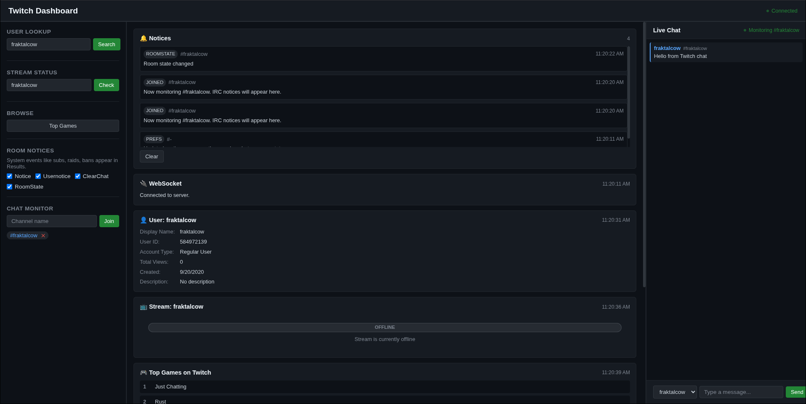

## go-twitch

Minimal Twitch dashboard and helper server in Go.



### Features
- OAuth user auth flow with status page (User/App tokens)
- App Access Token initialized on startup and persisted to `.env`
- Simple dashboard (room notices, lookups) with WebSocket/SSE
- REST endpoints for users, streams, and games
- Basic IRC helper endpoints

### Requirements
- Go 1.24+
- A Twitch application (Client ID/Secret)

### Quick Start
1. Create a Twitch app at `https://dev.twitch.tv/console/apps`.
2. Set the redirect URL in the Twitch app to `http://localhost:3000/auth/callback`.
3. Create `.env` in project root:

```
PORT=3000
TWITCH_CLIENT_ID=your_client_id
TWITCH_CLIENT_SECRET=your_client_secret
TWITCH_REDIRECT_URI=http://localhost:3000/auth/callback
TWITCH_BOT_USERNAME=your_bot_username
```

4. Run the server:

```
go run .
```

5. Open:
- `http://localhost:3000/` (main page)
- `http://localhost:3000/authorize` (authorize UI)
- `http://localhost:3000/dashboard` (dashboard)

Notes:
- On boot, the server fetches an App Access Token and writes it to `.env`.
- After OAuth, the user token and expiry are also written to `.env`.

### Environment
- PORT: HTTP port (default 3000)
- TWITCH_CLIENT_ID: Twitch app client ID
- TWITCH_CLIENT_SECRET: Twitch app client secret
- TWITCH_REDIRECT_URI: Must exactly match your Twitch app
- TWITCH_BOT_USERNAME: IRC helper username
- Generated by the app:
  - TWITCH_APP_ACCESS_TOKEN
  - TWITCH_APP_ACCESS_TOKEN_EXPIRES_AT (RFC3339)
  - TWITCH_USER_ACCESS_TOKEN
  - TWITCH_USER_ACCESS_TOKEN_EXPIRES_AT (RFC3339)

### Routes
- Static
  - `/` → `static/mainpage.html`
  - `/authorize` → authorization UI
  - `/dashboard` → dashboard UI

- OAuth
  - `GET /auth/start` → begin OAuth
  - `GET /auth/callback` → handle redirect, save user token
  - `GET /auth/status` → JSON token status
  - `GET /callback` → alias to `/auth/callback`

- REST
  - `GET /user/:name`
  - `GET /stream/:name`
  - `GET /games/top`

- IRC helper
  - `POST /irc/subscribe`
  - `POST /irc/subscribe/:channel`
  - `GET  /irc/subscribe/:channel` (HTML helper)
  - `POST /irc/unsubscribe`
  - `GET  /irc/unsubscribe/:channel` (HTML helper)
  - `POST /irc/send`

- Realtime
  - `GET /ws` → WebSocket
  - `GET /irc/:channel/stream` → SSE

### Usage Snippets
Authorize user in browser:
```
open http://localhost:3000/authorize
```

Check token status:
```
curl -s http://localhost:3000/auth/status | jq
```

Lookup a user:
```
curl -s http://localhost:3000/user/summit1g | jq
```

### Development
- Run: `go run .`
- Build: `go build -o bin/go-twitch .`

### Troubleshooting
- 401 from Twitch → verify Client ID/Secret and redirect URL
- Callback mismatch → update Twitch app redirect to match `TWITCH_REDIRECT_URI`
- Invalid dates in UI → ensure RFC3339 timestamps in `/auth/status`

### License
MIT
